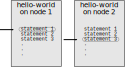
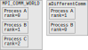

Let's start to explore the MPI functions in our `hello-world` program in detail. However before we do that let's first talk a little bit more about how MPI programs are executed to help better frame our discussion of these MPI functions.

## Program flow in MPI
Each process running an MPI program executes the same program in order from start to finish as a serial program would. The difference is there are multiple copies of the same program running simultaneously on different processes. At a given time during execution, different processes are very likely executing different lines of code. From one run of the MPI code to another the order in which processes reach a given line of code may change. In other words there is no reason that node 2 will execute `statement 1` before node 1, as is illustrated below. This order of execution can change from run to run.

If you program happens to depend on this order of execution this can lead to something called a **race condition** in which results or the stability of the program can depend on which process gets to which line of code first. Dependencies of this sort can usually be avoided by using some sort of synchronization mechanism (e.g. a blocking MPI function such as [`MPI_Barrier`](https://www.open-mpi.org/doc/v3.1/man3/MPI_Barrier.3.php), [`MPI_Send`](https://www.open-mpi.org/doc/v3.1/man3/MPI_Send.3.php), etc. ) and/or careful program design.

At first glance this seems like running a program this way won't get us anything as we are just replicating the work. However, we can write the program in such a way that different process will work on different parts of the data and even perform different tasks. Let's start looking at the MPI functions in our `hello-world` program in a little more detail to see how.

## Back to Hello-world
Let's have a look at the C and Fortran `hello-world` programs again and talk about the MPI functions and constants.

~~~
#include <stdio.h>
#include <mpi.h>

int main(int argc, char **argv) {
  
  int rank, size, ierr;
  
  ierr=MPI_Init(&argc,&argv);
  ierr=MPI_Comm_size(MPI_COMM_WORLD, &size);
  ierr=MPI_Comm_rank(MPI_COMM_WORLD, &rank);
  
  printf("Hello, World, from task %d of %d\n",rank, size);
  
  ierr=MPI_Finalize();
  return 0;
}
~~~
{: .language-c}
~~~
program helloworld
  use mpi
  implicit none
  integer :: rank, comsize, ierr
  
  call MPI_Init(ierr)
  call MPI_Comm_size(MPI_COMM_WORLD, comsize, ierr)
  call MPI_Comm_rank(MPI_COMM_WORLD, rank, ierr)
  
  print *,'Hello World, from task ', rank, 'of', comsize
  
  call MPI_Finalize(ierr)
end program helloworld
~~~
{: .language-fortran}

| Code (C/Fortran)| Description |
|---|--------|-------------|
| `#include <mpi.h>` `use mpi` | Imports declarations for MPI functions and constants in the same way C and Fortran import other header files and modules. |
| [`MPI_Init(&argc,&argv)`](https://www.open-mpi.org/doc/v3.1/man3/MPI_Init.3.php)   [`call MPI_INIT(ierr)`](https://www.open-mpi.org/doc/v3.1/man3/MPI_Init.3.php) | Initialize MPI. Must come first. Returns error code in ierr, if any. |
| [`MPI_Comm_size(MPI_COMM_WORLD, &size)`](https://www.open-mpi.org/doc/v3.1/man3/MPI_Comm_size.3.php)   [`call MPI_Comm_size(MPI_COMM_WORLD, comsize, ierr)`](https://www.open-mpi.org/doc/v3.1/man3/MPI_Comm_size.3.php) | Stores the number of process in `size`/`comsize`.|
| [`MPI_Comm_rank(MPI_COMM_WORLD, &rank)`](https://www.open-mpi.org/doc/v3.1/man3/MPI_Comm_rank.3.php)   [`call MPI_Comm_rank(MPI_COMM_WORLD, rank, ierr)`](https://www.open-mpi.org/doc/v3.1/man3/MPI_Comm_rank.3.php) | Stores the current process number in `rank`.|
| [`MPI_Finalize()`](https://www.open-mpi.org/doc/v3.1/man3/MPI_Finalize.3.php)   [`call MPI_FINALIZE(ierr)`](https://www.open-mpi.org/doc/v3.1/man3/MPI_Finalize.3.php) | Finish and clean up MPI. Must come last. Returns error code in ierr. |

> ## C / Fortran differences
> The C version 'MPI_Init' passes in the program's argument count and argument value array, while the Fortran version does not. From the OpenMPI docs page for [`MPI_Init`](https://www.open-mpi.org/doc/v3.1/man3/MPI_Init.3.php) it says 
> > Open MPI accepts the C/C++ argc and argv arguments to main, but neither modifies, interprets, nor distributes them
>
> The fortran versions of the MPI functions pass the error code back in the `ierr` parameter, while C versions of the MPI functions return the error code. For example in C `int ierr=MPI_Init(&argc,&argv);`, here `ierr` would contain the error code.
{: .callout}

Now that each process has a unique ID or `rank` and we know the total number of processes, `size`/`comsize`, we might start to guess at how we could use this to divide up our work. Perhaps something like this:

~~~
#define ARRAY_SIZE 1000

...

int array[ARRAY_SIZE];
int workSize=ARRAY_SIZE/size;
int workStart=workSize*rank;

for(int i=workStart;i<workStart+workSize;++i){
  
  //do something with array[i]
  
}

...
~~~
{: .language-c}
At this point we can already start to image how we can do some useful work with MPI. However, this simple example doesn't do much beyond what something like [GNU Parallel](https://docs.computecanada.ca/wiki/GNU_Parallel) could do for us with a serial program. MPI's functionality really starts to show when we start talking about message passing. However, before we dive into message passing let's talk about the `MPI_COMM_WORLD` constant and communicators in generall a little bit.

## Communicators

The `MPI_COMM_WORLD` is a constant which identifies the default MPI communicator. So what's a communicator? A communicator is a collection of process and a mapping between an ID or rank and those processes. All process are a member of the default MPI communicator `MPI_COMM_WORLD`. There can be multiple communicators in an MPI program and process can have different ranks within different communicators. In addition not all processes have to be in all communicators. Communicators are used when passing messages between process to help coordinate and organize which processes should get which messages.

The function `MPI_Comm_size(MPI_COMM_WORLD,&size)` gets the size of, or number of processes in, the communicator passed as an argument (in this case `MPI_COMM_WORLD`). The function `MPI_Comm_rank(MPI_COMM_WORLD,&rank)` gets the ID or rank of the current process within that communicator (in this case `MPI_COMM_WORLD`). Ranks within the communicator range for `0` to `size-1` where `size` is the size of the communicator.

It is possible to create your own communicators with [`MPI_Comm_create`](https://www.open-mpi.org/doc/v3.1/man3/MPI_Comm_create.3.php), however for the rest of this workshop we will only use the default `MPI_COMM_WORLD` communicator.

> ## Writting to stdout
> Beware!  Standard does not require that every process can write to stdout! However, in practice this is often possible, though not always desirable because the output can get jumbled and out of order, even within single print statements.
>
{: .callout}

