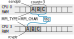

## MPI is a Library for *Message-Passing*
Message passing in MPI is what allows it to solve large non-separable problems on distributed hardware. If communication between processes is not required for your problem do not use MPI, use something like [GNU Parallel](https://docs.computecanada.ca/wiki/GNU_Parallel).

Communication and coordination between processes is done by sending and receiving messages. Each message involves a function call from at least two processes running the program. One process that has the data and one process that needs the data. It maybe that more than one process needs data only stored on one process or one process needs data scattered across multiple processes this type of communication involving many process are called **collective communication**.
 
Three basic sets of functionality provided by MPI:
 1. Pairwise (or point-to-point) communications via messages (e.g. [`MPI_Ssend`](https://www.open-mpi.org/doc/v3.1/man3/MPI_Ssend.3.php), [`MPI_Recv`](https://www.open-mpi.org/doc/v3.1/man3/MPI_Recv.3.php))
 2. Collective synchronization and communication (e.g. [`MPI_Barrier`](https://www.open-mpi.org/doc/v3.1/man3/MPI_Barrier.3.php), [`MPI_Scatter`](https://www.open-mpi.org/doc/v3.1/man3/MPI_Scatter.3.php), [`MPI_Gather`](https://www.open-mpi.org/doc/v3.1/man3/MPI_Gather.3.php), [`MPI_Reduce`](https://www.open-mpi.org/doc/v3.1/man3/MPI_Reduce.3.php), [`MPI_Allreduce`](https://www.open-mpi.org/doc/v3.1/man3/MPI_Allreduce.3.php))
 3. Efficient routines for getting data from memory into messages and vice versa (e.g. [`MPI_Pack`](https://www.open-mpi.org/doc/v3.1/man3/MPI_Pack.3.php), [`MPI_Unpack`](https://www.open-mpi.org/doc/v3.1/man3/MPI_Unpack.3.php))

<!--
### Rank and Size much more important in MPI than OpenMP

As we saw previously, we can get the number of process running our MPI program. In our code examples this is stored in the `size` or `commsize` variables and all processes have the same value for this variable. On the other hand we also have a variable `rank` which uniquely identifies a process. These values are used to 

In OpenMP the compiler assigns jobs to each thread and usually it isn't important which thread is doing which task. However, in MPI, size is ofte

: processes determine amongst themselves which piece of puzzle to work on, then communicate with appropriate others.

-->

Our "Hello World" program doesn't actually pass any messages.
Let's fix this by adding some pairwise communication, but first we need to know a little more about messages.

## Pairwise Messages
Pairwise messages have a **sender** and a **receiver** process. Each message has a unique non-negative integer **tag** to identify a particular message to ensure sending and receiving calls are for the correct message if there are multiple messages being sent between two processes.

An MPI message consists of `count` elements of type `MPI_TYPE` which are contiguous in memory beginning at `sendptr`. MPI types map to existing types in the language for example characters, integers, floating point numbers. A list of available MPI constants (both data type constants and other constants) can be found on this [MPICH documentation page](https://www.mpich.org/static/docs/latest/www3/Constants.html). 

To send a message the sender must call an MPI function to send the message. For the message to be received the receiver must call an MPI function to receive the message. Below are the pairs of C and Fortran functions to send and receive a message. Given our example diagram above `src_rank=0`, `dest_rank=3`, `MPI_TYPE=MPI_CHAR`. Return argument `status` contains information about the message, for example the process rank that sent the message.

~~~
MPI_Status status;
ierr=MPI_Ssend(sendptr, count, MPI_TYPE, dest_rank, tag, Communicator);
ierr=MPI_Recv(rcvptr, count, MPI_TYPE, src_rank, tag,Communicator, status);
~~~
{: .language-c}

~~~
integer status(MPI_STATUS_SIZE)
call MPI_SSEND(sendarr, count, MPI_TYPE, dest_rank,tag, Communicator, ierr)
call MPI_RECV(rcvarr, count, MPI_TYPE, src_rank, tag,Communicator, status, ierr)
~~~
{: .language-fortran}

## Our first message
Now that we have a basic understanding of how to send messages lets try it out.

~~~
$ cp hello-world.c firstmessage.c
$ nano firstmessage.c
~~~
{: .language-bash}

**Remember to replace `.c` with `.f90` if working with Fortran code**.

~~~
#include <stdio.h>
#include <mpi.h>

int main(int argc, char **argv){
  
  int rank, size, ierr;
  int sendto, recvfrom;       /* tasks to send to and receive from */
  int tag=1;                  /* shared tag to label msgs */
  char sendmessage[]="Hello"; /* text to send */
  char getmessage[6];         /* place to receive */
  MPI_Status rstatus;         /* MPI_Recv status info */
  
  ierr=MPI_Init(&argc,&argv);
  ierr=MPI_Comm_size(MPI_COMM_WORLD, &size);
  ierr=MPI_Comm_rank(MPI_COMM_WORLD, &rank);
  
  int count=6;
  if(rank==0){
    sendto=1;
    ierr=MPI_Ssend(sendmessage, count, MPI_CHAR, sendto, tag,
                   MPI_COMM_WORLD);
    printf("%d: Sent message <%s>\n",rank, sendmessage);
  }
  else if(rank==1){
    recvfrom=0;
    ierr=MPI_Recv(getmessage, count, MPI_CHAR, recvfrom, tag,
                  MPI_COMM_WORLD, &rstatus);
    printf("%d: Got message  <%s>\n",rank, getmessage);
  }
  
  ierr=MPI_Finalize();
  return 0;
}
~~~
{: .language-c}
**NOTE** `MPI_CHAR` is used in C to map to the C `char` datatype, while `MPI_CHARACTER` is used in Fortran to map to Fortran `character` datatype.
~~~
program firstmessage
  
  use mpi
  implicit none
  integer :: rank, comsize, ierr
  integer :: sendto, recvfrom  ! task to send,recv from 
  integer :: ourtag=1          ! shared tag to label msgs
  character(5) :: sendmessage  ! text to send
  character(5) :: getmessage   ! text to recieve 
  integer, dimension(MPI_STATUS_SIZE) :: rstatus
  integer :: count=5
  
  call MPI_Init(ierr)
  call MPI_Comm_size(MPI_COMM_WORLD, comsize, ierr)
  call MPI_Comm_rank(MPI_COMM_WORLD, rank, ierr)
  
  if(rank==0) then
    sendmessage='hello'
    sendto=1;
    call MPI_Ssend(sendmessage, count, MPI_CHARACTER, sendto, ourtag,
      MPI_COMM_WORLD,ierr) 
    print *,rank, 'sent message <',sendmessage,'>'
  else if(rank==1) then
    recvfrom=0;
    call MPI_Recv(getmessage, count, MPI_CHARACTER, recvfrom, ourtag,
      MPI_COMM_WORLD, rstatus,ierr)
    print *,rank, 'got message  <',getmessage,'>'
  endif
  
  call MPI_Finalize(ierr)
end program firstmessage
~~~
{: .language-fortran}

Now lets compile our program with either
~~~
$ mpicc -o firstmessage firstmessage.c
~~~
{: .language-bash}
**or**
~~~
$ mpif90 -o firstmessage firstmessage.f90
~~~
{: .language-bash}
depending on C or Fortran. Now lets run it with two processes
~~~
$ mpirun -np 2 ./firstmessage
~~~
{: .language-bash}
~~~
0: Sent message <Hello>
1: Got message <Hello>
~~~
{: .output}
