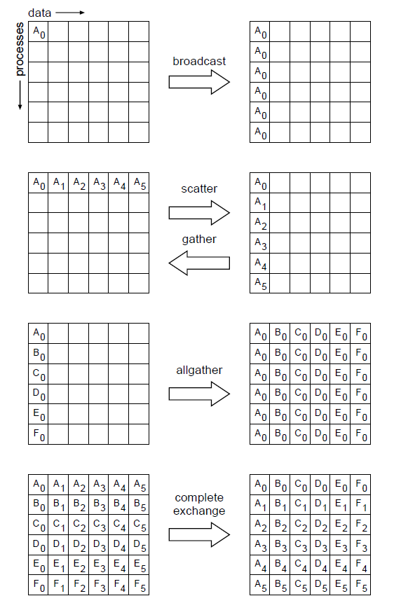

So far we have been working with point-to-point communication and with that you can construct most of the communication and with blocking send/receive communication even synchronization to some degree, though I wouldn't recommend doing synchronization that way. However, when the communication involves all the processes there are communication patterns for which MPI has supplied specialized communication functions to manage the details for you. This is much like when we used the combined `MPI_Sendrecev` function to combine the sending and receiving. MPI handled all the coordination for us to avoid deadlock.

## Min, mean, max

Consider a common task of calculating the min/mean/max of a bunch of numbers (in this case random) in the range $-1$..$1$. The min/mean/max should tend towards $-1$,$0$,$+1$ for large $N$.

### Serial
Let's take a quick look at the serial code for a min/mean/max calculation and think about how we might parallelize it.

~~~
#include <stdio.h>
#include <stdlib.h>

int main(int argc, char **argv) {
  
  /* generate random data */
  const int nx=1500;
  float *dat = (float *)malloc(nx * sizeof(float));
  srand(0);
  int i;
  for(i=0;i<nx;i++){
    dat[i] = 2*((float)rand()/RAND_MAX)-1.;
  }
  
  /* find min/mean/max */
  float datamin = 1e+19;
  float datamax =-1e+19;
  float datamean = 0;
  for(i=0;i<nx;i++){
    
    if(dat[i]<datamin){
      
      datamin=dat[i];
    }
    if(dat[i]>datamax){
      
      datamax=dat[i];
    }
    datamean += dat[i];
  }
  datamean /= nx;
  
  free(dat);
  
  printf("Min/mean/max = %f,%f,%f\n", datamin,datamean,datamax);
  
  return 0;
}
~~~
{: .language-c}

~~~
program randomdata
  
  implicit none
  integer ,parameter :: nx=1500
  real,allocate :: dat(:)
  
  integer :: i
  real :: datamin,datamax,datamean
  
  ! generate random data
  allocate(dat(nx))
  call random_seed(put=[(i,i=1,8])
  call random_number(dat)
  dat=2*dat-1.
  
  ! find min/mean/max
  datamin= minval(dat)
  datamax= maxval(dat)
  datamean= (1.*sum(dat))/nx
  
  deallocate(dat)
  
  print *,'min/mean/max =', datamin, datamean, datamax
  
  return
end
~~~
{: .language-fortran}

### Parallel
How do we parallelize it with MPI? Let's have each process generated a portion of $N$ and then have them compute local min/mean/max, send the local result to some process, say process $0$ to compute the final result and report it back to us. Graphically this would look something like:

> ## Complete the code
> Below are partial programs in both C and Fortran to implement the algorithm we just described. Choose one, copy it to a file called `minmeanmax-mpi.c` **or** `minmeanmax-mpi.f90`, and fill in the missing function parameters for both the `MPI_Ssend` and `MPI_Recv` calls identified by the `**** S T U F F   G O E S   H E R E ****` comments. Compile and run it.
> ~~~
> #include <stdio.h>
> #include <mpi.h>
> #include <stdlib.h>
> 
> int main(int argc, char **argv) {
>   
>   const int nx=1500;
>   float *dat;
>   int i;
>   float datamin, datamax, datamean;
>   float minmeanmax[3];
>   float globminmeanmax[3];
>   int ierr;
>   int rank, size;
>   int tag=1;
>   int masterproc=0;
>   MPI_Status status;
>   
>   ierr = MPI_Init(&argc, &argv);
>   ierr = MPI_Comm_size(MPI_COMM_WORLD,&size);
>   ierr = MPI_Comm_rank(MPI_COMM_WORLD,&rank);
>   
>   /* generate random data */
>   dat = (float *)malloc(nx * sizeof(float));
>   srand(rank);
>   for (i=0;i<nx;i++){
>     
>     dat[i] = 2*((float)rand()/RAND_MAX)-1.;
>   }
>   
>   /* find min/mean/max */
>   datamin = 1e+19;
>   datamax =-1e+19;
>   datamean = 0;
>   for (i=0;i<nx;i++) {
>     
>     if (dat[i] < datamin) datamin=dat[i];
>     if (dat[i] > datamax) datamax=dat[i];
>     datamean += dat[i];
>   }
>   datamean /= nx;
>   free(dat);
>   minmeanmax[0] = datamin;
>   minmeanmax[2] = datamax;
>   minmeanmax[1] = datamean;
>   
>   printf("Proc %d min/mean/max = %f,%f,%f\n",
>          rank, minmeanmax[0],minmeanmax[1],minmeanmax[2]);
>   if (rank != masterproc) {
>     
>     ierr = MPI_Ssend( /***** S T U F F   G O E S   H E R E *****/ );
>   }
>   else {
>       globminmeanmax[0] = datamin;
>       globminmeanmax[2] = datamax;
>       globminmeanmax[1] = datamean;
>       for (i=1;i<size;i++) {
>         
>         ierr = MPI_Recv( /***** S T U F F   G O E S   H E R E *****/ );
>         
>         globminmeanmax[1] += minmeanmax[1];
>         
>         if (minmeanmax[0] < globminmeanmax[0]){
>           
>           globminmeanmax[0] = minmeanmax[0];
>         }
>         
>         if (minmeanmax[2] > globminmeanmax[2]){
>           
>           globminmeanmax[2] = minmeanmax[2];
>         }
>       }
>       globminmeanmax[1] /= size;
>       printf("Min/mean/max = %f,%f,%f\n", globminmeanmax[0],
>              globminmeanmax[1],globminmeanmax[2]);
>   }
>   
>   ierr = MPI_Finalize();
>   
>   return 0;
> }
> ~~~
> {: .language-c}
> ~~~
> program randomdata
>   use mpi
>   implicit none
>   integer,parameter :: nx=1500
>   real, allocatable :: dat(:)
>   
>   integer :: i,n
>   real    :: datamin, datamax, datamean
>   real    :: globmin, globmax, globmean
>   integer :: ierr, rank, comsize
>   integer :: ourtag=5
>   real, dimension(3) :: sendbuffer, recvbuffer
>   integer, dimension(MPI_STATUS_SIZE) :: status
>   
>   call MPI_INIT(ierr)
>   call MPI_COMM_SIZE(MPI_COMM_WORLD, comsize, ierr)
>   call MPI_COMM_RANK(MPI_COMM_WORLD, rank, ierr)
>   
>   ! random data
>   allocate(dat(nx))
>   call random_seed(size=n)
>   call random_seed(put=[(rank,i=1,n)])
>   call random_number(dat)
>   dat = 2*dat - 1.
>   
>   ! find min/mean/max
>   datamin = minval(dat)
>   datamax = maxval(dat)
>   datamean= (1.*sum(dat))/nx
>   deallocate(dat)
>   
>   if (rank /= 0) then
>     sendbuffer(1) = datamin
>     sendbuffer(2) = datamean
>     sendbuffer(3) = datamax
>     
>     call MPI_SSEND()  ! ***** S T U F F   G O E S   H E R E *****
>     
>   else
>     globmin = datamin
>     globmax = datamax
>     globmean = datamean
>     do i=2,comsize
>       
>       call MPI_RECV() ! ***** S T U F F   G O E S   H E R E *****
>       
>       if (recvbuffer(1) < globmin) globmin=recvbuffer(1)
>       if (recvbuffer(3) > globmax) globmax=recvbuffer(3)
>       globmean = globmean + recvbuffer(2)
>     enddo
>     globmean = globmean / comsize
>   endif
>   
>   print *,rank, ': min/mean/max = ', datamin, datamean, datamax
>   
>   if (rank==0) then
>     print *, 'global min/mean/max = ', globmin, globmean, globmax
>   endif
>   
>   call MPI_FINALIZE(ierr)
> end
> ~~~
> {: .language-fortran}
> Are the sends and receives adequately paired?
>
> > ## Solutions
> > 
> > ~~~
> >  . . .
> >  if(rank!=masterproc){
> >    
> >    ierr=MPI_Ssend(minmeanmax,3,MPI_FLOAT,masterproc,tag,MPI_COMM_WORLD);
> >  } 
> >  else{
> >    
> >    globminmeanmax[0]=datamin;
> >    globminmeanmax[2]=datamax;
> >    globminmeanmax[1]=datamean;
> >  }
> >  for (i=1;i<size;i++) {
> >    
> >    ierr = MPI_Recv(minmeanmax,3,MPI_FLOAT,MPI_ANY_SOURCE,tag,
> >                    MPI_COMM_WORLD,&status);
> >    
> >    globminmeanmax[1] += minmeanmax[1];
> >    
> >    if(minmeanmax[0] < globminmeanmax[0]){
> >      
> >      globminmeanmax[0] = minmeanmax[0];
> >    }
> >    
> >    if(minmeanmax[2] > globminmeanmax[2]){
> >      
> >      globminmeanmax[2] = minmeanmax[2];
> >    }
> >  }
> >  globminmeanmax[1] /= size;
> >  printf("Min/mean/max = %f,%f,%f\n", globminmeanmax[0],globminmeanmax[1],
> >         globminmeanmax[2]);
> >  . . .
> > ~~~
> > {: .language-c}
> > ~~~
> >  . . .
> >  datamin = minval(dat)
> >  datamax = maxval(dat)
> >  datamean = (1.*sum(dat))/nx
> >  deallocate(dat)  
> >  
> >  if (rank /= 0) then
> >    sendbuffer(1) = datamin
> >    sendbuffer(2) = datamean
> >    sendbuffer(3) = datamax
> >    call MPI_Ssend(sendbuffer, 3, MPI_REAL, 0, ourtag, MPI_COMM_WORLD, ierr)  
> >  else
> >    globmin = datamin
> >    globmax = datamax
> >    globmean = datamean
> >    
> >    do i=2,comsize 
> >      call MPI_Recv(recvbuffer, 3, MPI_REAL, MPI_ANY_SOURCE, &
> >                    ourtag, MPI_COMM_WORLD, status, ierr)
> >      if (recvbuffer(1) < globmin) globmin=recvbuffer(1)
> >      if (recvbuffer(3) > globmax) globmax=recvbuffer(3)
> >      globmean = globmean + recvbuffer(2)
> >    enddo
> >    
> >    globmean = globmean / comsize
> >  endif
> >
> >  print *,rank, ': min/mean/max = ', datamin, datamean, datamax
> >  . . .
> > ~~~
> > {: .language-fortran}
> > Then compile with
> > ~~~
> > $ mpicc -o minmeanmax-mpi minmeanmax-mpi.c
> > ~~~
> > {: .language-bash}
> > **or**
> > ~~~
> > $ mpif90 -o minmeanmax-mpi minmeanmax-mpi.f90
> > ~~~
> > {: .language-bash}
> > and run
> > ~~~
> > $ mpirun -np 4 ./minmeanmax-mpi
> > ~~~
> > {: .language-bash}
> > ~~~
> > Proc 0 min/mean/max = -0.999906,0.001355,0.999987
> > Min/mean/max = -0.999906,0.009106,0.999987
> > Proc 1 min/mean/max = -0.999906,0.001355,0.999987
> > Proc 2 min/mean/max = -0.998753,0.038589,0.998893
> > Proc 3 min/mean/max = -0.997360,-0.004877,0.999729
> > ~~~
> > {: .output}
> {: .solution}
{: .challenge}

## A better method
This works, but we can do better, or rather there is an MPI function which can do better. This method requires $(P-1)$ messages where $P$ is the number of processes. In addition if all processes need the result it will be  $2(P-1)$. A better method would be:

  1. Processes are paired up
  2. One process sends their local results to the other
  3. The other process receiving the result computes the sub results
  4. Repeat steps 1-3 pairing up only processes which received and computed sub results in step 3 until only one process remains.

The cases illustrated here have fairly small numbers of processes, the reduction in number of messages sent is fairly minimal. However, if we scale up so the number of processes, $P$, is very large this method can start to show considerable improvements. The maximum number messages sent is $log2(P)$. The same method can be used to send the total back to all processes. There for the total time for communication $T_{comm}$ can be related to the number of processes $P$ and the time for communicating a single message, $C_{comm}$ as

$$T_{comm}=2\log_2(P)C_{comm}$$

This process of combining many numbers into a single result is referred to as a **reduction** process. This algorithm will work for a variety of operators ($+$,$\times$,$min()$,$max()$, ...).

## Collective operations

MPI supplies some functions which will perform the above process for us, [`MPI_Reduce`](https://www.open-mpi.org/doc/v3.1/man3/MPI_Reduce.3.php) if only one process needs the result, and [`MPI_Allreduce`](https://www.open-mpi.org/doc/v3.1/man3/MPI_Allreduce.3.php) if all processes need the result.

<!--
~~~
  print *,rank,': min/mean/max = ', datamin, datamean, datamax
     
  !
  ! Combine data
  !
  call MPI_ALLREDUCE(datamin, globmin, 1, MPI_REAL, MPI_MIN, &
                     MPI_COMM_WORLD, ierr)
  !
  ! If only task 0 needs the result:
  !    call MPI_REDUCE(datamin, globmin, 1, MPI_REAL, MPI_MIN, &
  !                    0, MPI_COMM_WORLD, ierr)
  !
  call MPI_ALLREDUCE(datamean, globmean, 1, MPI_REAL, MPI_SUM, &
                     MPI_COMM_WORLD, ierr)
  globmean = globmean/comsize
  if (rank == 0) then
      print *, rank,': Global min/mean/max=',globmin,globmean,globmax 
  endif
 
~~~
{: .language-fortran}
-->

As an example an `MPI_Reduce` function call might look this:
~~~
  call MPI_REDUCE(datamin, globmin, 1, MPI_REAL, MPI_MIN, &
                  0, MPI_COMM_WORLD, ierr)
~~~
{: .language-fortran}

As opposed to the pairwise messages we've seen so far, **all** processes in the communicator must participate and they may not proceed until all have participated in the function call. While you **can** implement these patterns yourself with Sends/Recvs, it will likely be less clear and slower, especially for large numbers of processes.

> ## Run the AllReduce code
> Copy the below code C or Fortran into `minmeanmax-allreduce.c` or `minmeanmax-allreduce.f90}`
> ~~~
> #include <stdio.h>
> #include <mpi.h>
> #include <stdlib.h>
> 
> int main(int argc, char **argv) {
>   
>   const int nx=1500;  // number of data per process
>   float *dat;         // local data
>   int i;
>   float datamin, datamax, datasum, datamean;
>   float globmin, globmax, globsum, globmean;
>   int ierr;
>   int rank, size;
>   MPI_Status status;
> 
>   ierr = MPI_Init(&argc, &argv);
>   ierr = MPI_Comm_size(MPI_COMM_WORLD,&size);
>   ierr = MPI_Comm_rank(MPI_COMM_WORLD,&rank);
> 
>   /*generate random data at each process*/
>   dat = (float *)malloc(nx * sizeof(float));
>   srand(rank);
>   for (i=0;i<nx;i++) {
>     dat[i] = 2*((float)rand()/RAND_MAX)-1.;
>   }
> 
>   /*find local min/sum/max*/
>   datamin = 1e+19;
>   datamax =-1e+19;
>   datasum = 0;
> 
>   for (i=0;i<nx;i++) {
>     if (dat[i] < datamin) datamin=dat[i];
>     if (dat[i] > datamax) datamax=dat[i];
>     datasum += dat[i];
>   }
>   datamean = datasum/nx;
>   free(dat);
> 
>   printf("Proc %d min/mean/max = %f,%f,%f\n",
>          rank, datamin, datamean, datamax);
> 
>   /* combine local results*/
>   ierr = MPI_Allreduce(&datamin, &globmin, 1, MPI_FLOAT, MPI_MIN,
>                   MPI_COMM_WORLD);
>   
>   ierr = MPI_Allreduce(&datasum, &globsum, 1, MPI_FLOAT, MPI_SUM,
>                        MPI_COMM_WORLD);
>   ierr = MPI_Allreduce(&datamax, &globmax, 1, MPI_FLOAT, MPI_MAX,
>                        MPI_COMM_WORLD);
>   globmean = globsum/(size*nx);
> 
>   /* to just send to task 0:
>   ierr = MPI_Reduce(&datamin, &globmin, 1, MPI_FLOAT, MPI_MIN,
>                     0, MPI_COMM_WORLD);
>    */
> 
>   if (rank == 0) {
>      printf("Global min/mean/max = %f, %f, %f\n",
>              globmin, globmean, globmax);
>   }
> 
>   ierr = MPI_Finalize();
>   return 0;
> }
> ~~~
> {: .language-c}
> ~~~
>   program randomdata
>   use mpi
>   implicit none
> 
>   integer,parameter :: nx=1500
>   real, allocatable :: dat(:)
> 
>   integer :: i,n
>   real    :: datamin, datamax, datamean
>   real    :: globmin, globmax, globmean
>   integer :: rank, comsize, ierr
> 
>   call MPI_INIT(ierr)
>   call MPI_COMM_RANK(MPI_COMM_WORLD,rank,ierr)
>   call MPI_COMM_SIZE(MPI_COMM_WORLD,comsize,ierr)
> 
>   ! random data
>   allocate(dat(nx))
>   call random_seed(size=n)
>   call random_seed(put=[(rank,i=1,n)])
>   call random_number(dat)
>   dat = 2*dat - 1.
> 
>   ! find local min/mean/max
>   datamin = minval(dat)
>   datamax = maxval(dat)
>   datamean= (1.*sum(dat))/nx
>   deallocate(dat)
> 
>   print *,rank,': min/mean/max = ', datamin, datamean, datamax
> 
>   ! combine data
>   call MPI_ALLREDUCE(datamin, globmin, 1, MPI_REAL, MPI_MIN, &
>                     MPI_COMM_WORLD, ierr)
> 
>   ! to just send to task 0:
>   !  call MPI_REDUCE(datamin, globmin, 1, MPI_REAL, MPI_MIN,
>   !&                    0, MPI_COMM_WORLD, ierr)
> 
>   call MPI_ALLREDUCE(datamax, globmax, 1, MPI_REAL, MPI_MAX, &
>                    MPI_COMM_WORLD, ierr)
>   call MPI_ALLREDUCE(datamean, globmean, 1, MPI_REAL, MPI_SUM, &
>                    MPI_COMM_WORLD, ierr)
>   globmean = globmean/comsize
>   if (rank == 0) then
>      print *, rank,': Global min/mean/max=',globmin,globmean,globmax
>   endif
> 
>   call MPI_FINALIZE(ierr)
>   end program randomdata
> ~~~
> {: .language-fortran}
> Examine it, compile it, test it.
{: .challenge}

## Common patterns of communication

Here are some families of MPI routines that implement common communication patterns.

- MPI_Bcast: Broadcast data from one process to all--- every process gets a copy
- MPI_Scatter: Scatter data from one process to all--- every process gets a different slice
- MPI_Gather: Collect data from all processes to one process, opposite of Scatter
- MPI_AllGather: A variation on Gather where the result is then distributed to all processes
- MPI_AllToAll: Scatter/Gather from all procs to all procs--- In other words, a complete exchange (of some data structure)
- MPI_Allreduce: Global reduction (e.g. sum, max, min, ...) where the result is then broadcast to all procs
- MPI_Barrier: Forces all processes to synchronize, i.e. wait for the last one to catch up before moving on

By "families" we mean that there are several related routines in each family, e.g. `MPI_Scatter, MPI_IScatter, MPI_ScatterV, MPI_IScatterV`

