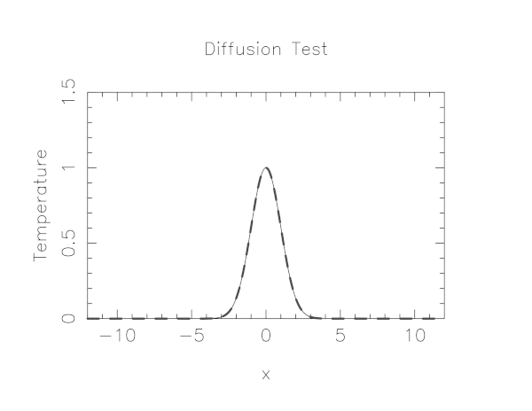
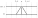

## Diffusion Equation
The change in temperature of the wire over time can be modelled using a 1-dimensional partial differential equation, the thermal diffusion equation:

$$\frac{\partial T}{\partial t}=D\frac{\partial^2 T}{\partial x^2}$$

where $T$ is temperature, $t$ is time, $x$ is position, $D$ is the "diffusion coefficient".

To use a partial differential equation to model with a computer how a quantity, in this case the temperature along a wire changes over time, we must discretize that quantity onto a finite set of grid points. The more grid points, the more closely it approximates a real continuous wire. At each of these grid points we can then set some initial temperature and from that use our thermal diffusion equation to calculate a temperature after some time passes, the time step. We can repeat this process moving from the last state to the next new state in order to calculate how the temperature along the wire changes over time.

## Discretizing Derivatives

How can we translate our continuous thermal diffusion equation to our discretization temperature grid that we can use to model this physical problem with a computer. Lets start by looking at the partial derivative of temperature with respect to position on the right hand of the equation.

$$\frac{\partial^2 T}{\partial x^2}=\frac{\partial}{\partial x}\frac{\partial T}{\partial x}$$

Breaking it down even further, lets focus at first just on the first order partial derivative of temperature with respect to position. We can approximate the partial derivative with finite differences between grid points.

$$\frac{\partial T}{\partial x} \approx \frac{\Delta T}{\Delta x}$$

If we have an equal grid spacing, $\Delta x$, the spacing between successive grid points will be constant along our grid. If we then label each $T$ along our discretization of the wire with an $i$ to indicate at which grid point it is located, we can write our partial derivative like this

$$\frac{\Delta T}{\Delta x}\biggr|_{i+1/2} = \frac{ T_{i+1}-T_{i} }{ \Delta x }$$

That is, the partial derivative of $T$ with respect to position at the mid point ($i+1/2$) between grid cells $i$ and $i+1$. We can this use this to approximate our second order partial differential of temperature with respect to position in the same way

$$\frac{\partial^2 T}{\partial x^2}\biggr|_{i} \approx \frac{\frac{\Delta T}{\Delta x}\biggr|_{i+1/2}-\frac{\Delta T}{\Delta x}\biggr|_{i-1/2}}{\Delta x}=\frac{T_{i+1}-2T_i+T_{i-1}}{(\Delta x)^2}$$

Now lets recall our original equation that we are trying to discretize

$$\frac{\partial T}{\partial t}=D\frac{\partial^2 T}{\partial x^2}$$

We now have a representation for the right hand side that we can translate into computer code, however, we still need to deal with the left hand side, the time derivative. We can do exactly the same procedure we did for the spatial derivative. Lets define $n$ to represent a particular point in time (like $i$ represented a particular point in space). We can also approximate the partial differential with respect to time by differences in temperature from one time to the next. Doing so we get

$$\frac{T^{n+1}_{i}-T^{n}_i}{\Delta t} \approx D \frac{T_{i+1}^n-2T_i^n+T_{i-1}^n}{(\Delta x)^2}$$

Note that I have replaced the second order partial diffiental with respect to position with our finite difference representation. Isolating for the new temperature we get

$$T^{n+1}_{i} \approx T^{n}_i + \frac{D \Delta t}{(\Delta x)^2}(T_{i+1}^n-2T_i^n+T_{i-1}^n)$$

This approximation will allow us to compute a new temperature $T$ given the previous temperatures. This approximation uses three grid points to approximate our second order partial differential. The number and relative position of the surrounding points used in computing a quantity in a given cell is often referred to as a "stencile".

## Build & run serial version

In `mpi-tutorial/diffusion` is a serial code which simulates the heat flow in a thin wire where the initial condition is that the wire has a very hot spot in the center and the surrounding portions of the wire are cooler. Using the thermal diffusion equation with the discretized version we outline above this code simulates the diffusion of heat from the hot spot to the cooler parts of the wire.

The code uses a simple graphics library called `pgplot` to draw the temperature profile.  You'll need to have X11 running in your SSH client in order to see the plot.  In either case, it will emit many timesteps and error estimates to standard output.

~~~
$ git clone https://github.com/acenet-arc/mpi-tutorial.git
$ cd mpi-tutorial/diffusion
$ git pull origin master   # get latest code updates
$ module load pgplot
$ make diffusionc    # or make diffusionf 
$ ./diffusionc       # or ./diffusionf
~~~
{: .language-bash}
~~~
Step = 0, Time = 5.77154e-05, Error = 3.04144e-07
Step = 1, Time = 0.000115431, Error = 3.74087e-07
.
.
.
Step = 99998, Time = 5.76987, Error = 0.00566646
Step = 99999, Time = 5.76993, Error = 0.00566676
~~~
{: .output}

> ## If `The following module(s) are unknown: "pgplot"`
> Load the following module before attempting to load the pgplot module
> ~~~
> $ module load arch/avx2
> $ module load pgplot
> ~~~
> {: .language-bash}
{: .callout}

## Domain Decomposition

To solve this in parallel, each process must be responsible for some segment of space, i.e. a chunk of the wire. 
- A very common approach to parallelizing on distributed memory computers
- Maintain Locality; need local data mostly, this means only surface data needs to be sent
between processes.
- Pictures of a few problems being solved with domain decomposition:

## Implement a diffusion equation in MPI

Given our update equation for the temperature:

$$T^{n+1}_{i} \approx T^{n}_i + \frac{D \Delta t}{(\Delta x)^2}(T_{i+1}^n-2T_i^n+T_{i-1}^n)$$

we will have the below stencil:

The question then becomes, what do we do at the edges of the local sub domains on each process, since to compute the new temperature, $T_{i}^{n+1}$, will will need information about temperatures at the previous timestep $n$ from other processors local sub domains?

### Guardcells

- Job 1 needs info on Job 2's first zone, Job 2 needs info on Job 1's last zone
- Pad array with `guardcells' and fill them with the info from the appropriate node by messagepassing or shared memory

- Do computation
- guardcell exchange: each process has to do 2 sendrecvs
  - its rightmost cell with neighbor's leftmost
  - its leftmost cell with neighbor's rightmost
  - Need a convention to avoid deadlock
  - Everyone do right-filling first, then left-filling (say)
  - What happens at absolute left and absolute right ends of everything?  Pick one:
  - Periodic boundary conditions, as if the wire were a loop
  - Fixed-temperature boundary conditions, temperature in first, last zones some fixed value

> ## Hands-on: MPI diffusion
> Convert the serial version of the diffusion program to a parallel version.
> ~~~
> $ cp diffusionf.f90 diffusionfmpi.f90 
> ~~~
> {: .language-bash}
> **or**
> ~~~
> $ cp diffusionc.c diffusionc-mpi.c
> ~~~
> {: .language-bash}
> Edit with `nano` to make an MPI version. This will involve the following components:
> - add standard MPI calls: init, finalize, comm_size, comm_rank
> - Figure out how many points each process is responsible for (localsize=totpoints/size)
> - Figure out neighbors, left/right
> - Compute the new temperature starting at `start=localsize*rank`, end at `end=start+localsize`
> - At end of each time step, exchange guardcells; use sendrecv
> - Get total error
>
> Then build with:
> ~~~
> $ make diffusionf-mpi
> ~~~
> {: .language-bash}
> **or**
> ~~~
> $ make diffusionc-mpi
> ~~~
> {: .language-bash}
> - Test on 1..8 procs
> 
> **MPI routines we know so far**
> ~~~
> MPI_Status status;
> 
> ierr = MPI_Init(&argc,&argv);	
> ierr = MPI_Comm_size(communicator, &size);
> ierr = MPI_Comm_rank(communicator, &rank);
> ierr = MPI_Send(sendptr, count, MPI_TYPE, destination, tag, communicator);
> ierr = MPI_Recv(recvptr, count, MPI_TYPE, source,      tag, communicator, &status);
> 
> ierr = MPI_Sendrecv(sendptr, count, MPI_TYPE, destination, tag,
>                     recvptr, count, MPI_TYPE, source,      tag, communicator, &status);
> 
> ierr = MPI_Allreduce(&mydata, &globaldata, count, MPI_TYPE, MPI_OP, Communicator);
> 
> Communicator -> MPI_COMM_WORLD
> MPI_Type -> MPI_FLOAT, MPI_DOUBLE, MPI_INT, MPI_CHAR...
> MPI_OP -> MPI_SUM, MPI_MIN, MPI_MAX,...
> ~~~
> {: .language-c}
> 
> ~~~
> integer status(MPI_STATUS_SIZE)
> 
> call MPI_INIT(ierr)
> call MPI_COMM_SIZE(Communicator, size, ierr)
> call MPI_COMM_RANK(Communicator, rank, ierr)
> call MPI_SSEND(sendarr, count, MPI_TYPE, destination, tag, Communicator, ierr)
> call MPI_RECV(recvarr,  count, MPI_TYPE, destination, tag, Communicator, status, ierr)
> 
> call MPI_SENDRECV(sendptr, count, MPI_TYPE, destination, tag, &
>                   recvptr, count, MPI_TYPE, source,      tag, Communicator, status, ierr)
> 
> call MPI_ALLREDUCE(mydata, globaldata, count, MPI_TYPE, MPI_OP, Communicator, ierr)
> 
> Communicator -> MPI_COMM_WORLD
> MPI_Type -> MPI_REAL, MPI_DOUBLE_PRECISION, MPI_INTEGER, MPI_CHARACTER,...
> MPI_OP -> MPI_SUM, MPI_MIN, MPI_MAX,...
> ~~~
> {: .language-fortran}
{: .challenge}
